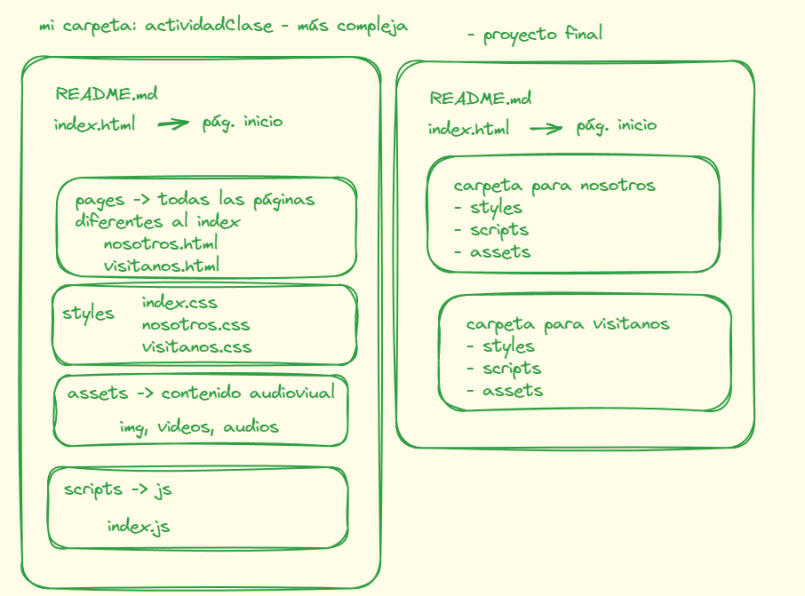
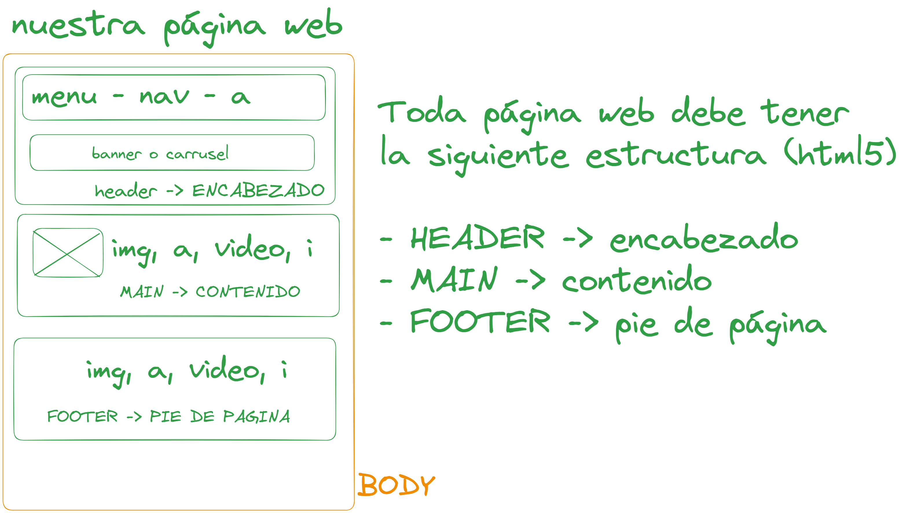
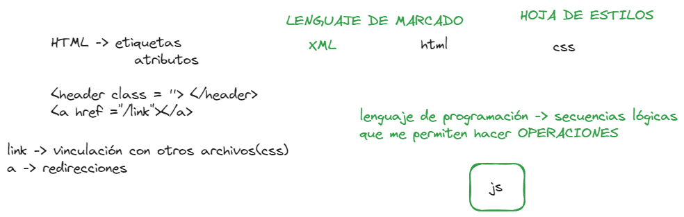
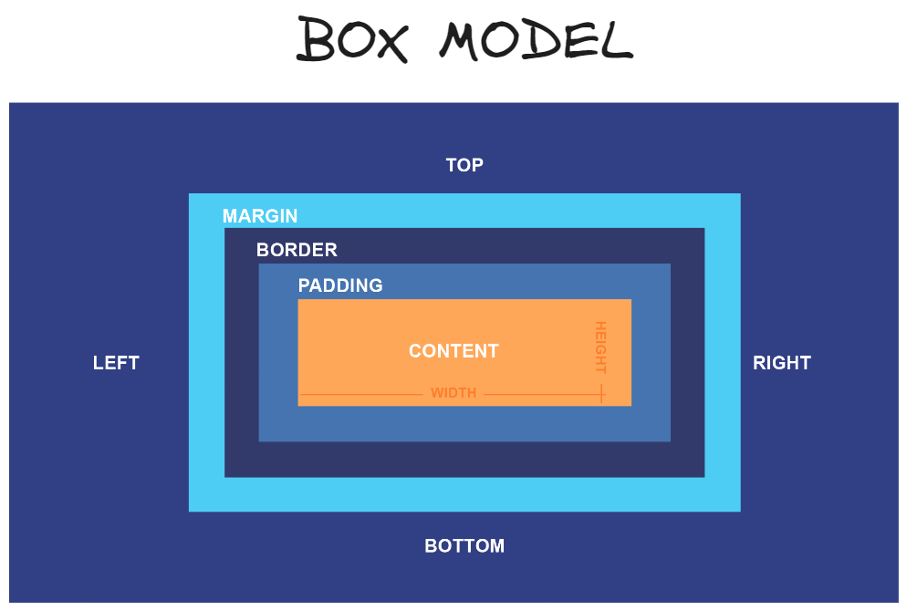
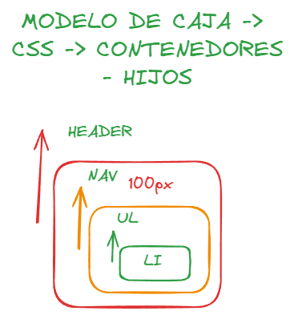
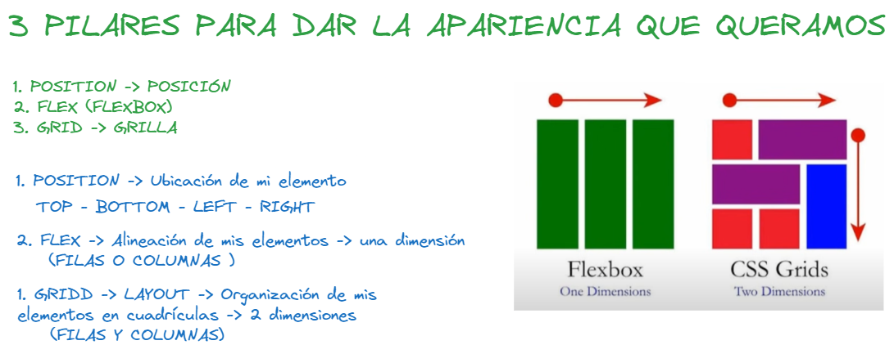
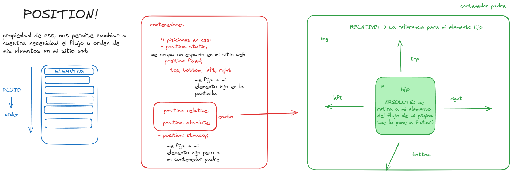
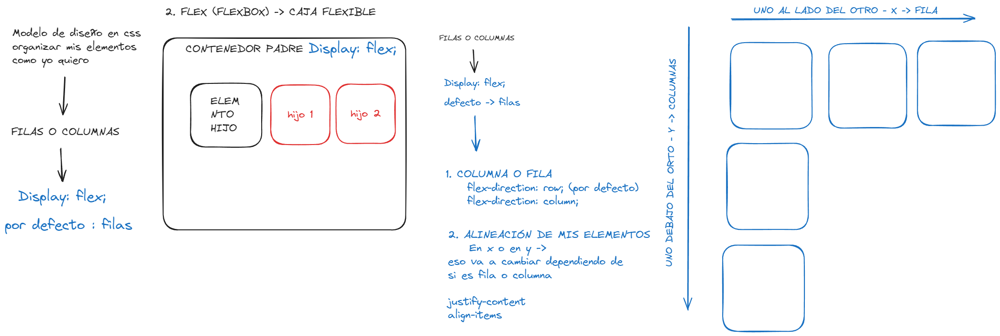
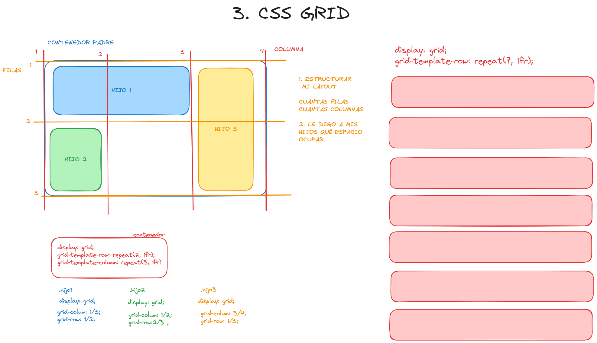
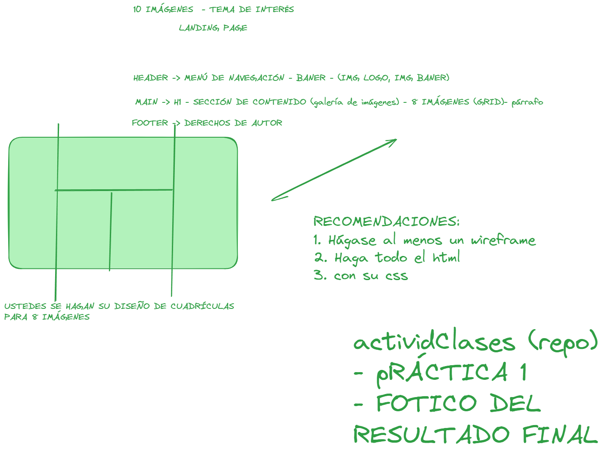

<!-- Centrar el título -->
<h1 align="center">Material esquemático de las clases por tema</h1>

<!-- Subtítulo -->

<em>Bootcamp en Desarrollo Web Full-Stack 202405 - Modulo 1: Funtamentos de programación</em>

<!-- Separador -->

<!-- Tabla de Contenido -->
<h2 align="center">Tabla de Contenido</h2>

1. [**Estructura de Proyectos de Desarrollo Web**](#estructura-de-proyectos-de-desarrollo-web) 🗂️
2. [**Estructura básica de etiquetas para una página con HTML**](#estructura-basica-de-etiquetas) 📄
3. [**HTML y CSS vs. JavaScript**](#html-y-css-vs-javascript) 💻
4. [**Box Model en CSS**](#box-model-en-css) 📦
5. [**Modelos de Diseño en CSS**](#modelos-de-diseño-en-css) 🎨
    - [**Position**](#position) 📍
    - [**Flexbox**](#flexbox) 📐
    - [**Grid**](#grid) 🗃️
6. [**Primera Práctica**](#primera-práctica) 📝
7. [**Propiedades Útiles en CSS**](#propiedades-útiles-en-css) 🔧
8. [**Playlist de las Sesiones**](#videos-de-las-sesiones) 🎥

<!-- Separador -->

<!-- Contenido de cada sección -->

## Estructura de Proyectos de Desarrollo Web

<b>Organización de carpetas y archivos.</b>

Es fundamental mantener una estructura clara y organizada en tus proyectos de desarrollo web. Una buena estructura facilita la mantenibilidad y escalabilidad del proyecto.

### Material Recomendado 📚🎥
- [Artículo sobre Estructura de Proyectos Web](https://developer.mozilla.org/es/docs/Learn/Getting_started_with_the_web/Dealing_with_files) 📚

---

## Estructura Básica de Etiquetas

<b>Uso de etiquetas <code>header</code>, <code>main</code> y <code>footer</code>.</b>

Utilizar etiquetas semánticas como <code>header</code>, <code>main</code> y <code>footer</code> mejora la accesibilidad y SEO de tu sitio web. A continuación, se detalla la función de cada una de estas etiquetas y el tipo de contenido que generalmente contienen:

### Header

La etiqueta <code>&lt;header&gt;</code> se utiliza para contener la sección introductoria de una página o un documento. Generalmente, incluye:

<ul>
  <li>Logotipo del sitio web</li>
  <li>Barra de navegación (menú)</li>
  <li>Título principal de la página</li>
  <li>Elementos de encabezado (como <code>&lt;h1&gt;</code>, <code>&lt;h2&gt;</code>)</li>
</ul>

### Main

La etiqueta <code>&lt;main&gt;</code> representa el contenido principal del documento, que es único y central para la funcionalidad de la página. Dentro de <code>&lt;main&gt;</code>, generalmente se encuentran:

<ul>
  <li>Artículos o secciones de contenido</li>
  <li>Imágenes y gráficos relevantes</li>
  <li>Vídeos y otros elementos multimedia</li>
  <li>Textos y párrafos principales</li>
</ul>

### Footer

La etiqueta <code>&lt;footer&gt;</code> se utiliza para definir el pie de página de un documento o sección. Contiene información de cierre y elementos secundarios, como:

<ul>
  <li>Información de contacto</li>
  <li>Enlaces de navegación secundarios</li>
  <li>Derechos de autor y notas legales</li>
  <li>Redes sociales y enlaces de seguimiento</li>
</ul>

### Material Recomendado 📚🎥
- [Documentación sobre HTML Semántico](https://developer.mozilla.org/en-US/docs/Glossary/Semantics) 📚

---

## HTML y CSS vs. JavaScript

<b>HTML y CSS no son lenguajes de programación, mientras que JavaScript sí lo es.</b>

HTML y CSS son lenguajes de marcado y estilo, respectivamente, NO se consideran lenguajes de programación porque no pueden manipular datos o realizar operaciones lógicas. JavaScript por otro lado, sí es un lenguaje de programación, tiene la capacidad de manejar estructuras de control, funciones, eventos, y puede manipular datos dinámicamente; Además, permite crear lógica de negocio, interactividad y operaciones complejas en una página web.

---

## Box Model en CSS

<b>Conceptos de contenedores padre e hijos.</b>

El modelo de caja en CSS describe cómo se estructuran los elementos en la web mediante márgenes, bordes, padding y el contenido mismo.

### Material Recomendado 📚🎥
- [Documentación sobre Box Model](https://developer.mozilla.org/en-US/docs/Web/CSS/CSS_Box_Model) 📚
- [Video sobre Box Model en YouTube](https://www.youtube.com/watch?v=1KkoCNojnNQ) 🎥

---

## Modelos de Diseño en CSS

<b>Uso de <code>position</code>, <code>flexbox</code> y <code>grid</code>.</b>

### Positioning

<b>El modelo de posicionamiento en CSS</b> permite colocar elementos en ubicaciones específicas dentro de un contenedor o en la página. Los principales valores de <code>position</code> son:

<ul>
  <li><code>position: absolute;</code> - Posiciona un elemento en relación a su primer contenedor posicionado (no estático) más cercano.</li>
  <li><code>position: relative;</code> - Posiciona un elemento en relación a su posición original en el flujo del documento.</li>
  <li><code>position: fixed;</code> - Posiciona un elemento en relación a la ventana del navegador, permanece en la misma posición incluso al desplazar la página.</li>
  <li><code>position: sticky;</code> - Permite que un elemento se comporte como <code>relative</code> hasta que alcanza un punto definido en el viewport, momento en el cual se comporta como <code>fixed</code>.</li>
</ul>

### Flexbox

<b>Flexbox</b> es un modelo de diseño unidimensional que se utiliza para distribuir espacio y alinear elementos dentro de un contenedor flexible.

<ul>
  <li>Utiliza dos ejes: el eje principal (main axis) y el eje transversal (cross axis).</li>
  <li>Propiedades como <code>justify-content</code>, <code>align-items</code> y <code>align-self</code> se usan para alinear y distribuir los elementos.</li>
</ul>

### Grid Layout

<b>Grid Layout</b> es un modelo de diseño bidimensional que permite crear diseños complejos de cuadrícula mediante la definición de filas y columnas.

<ul>
  <li>Define filas y columnas usando propiedades como <code>grid-template-rows</code> y <code>grid-template-columns</code>.</li>
  <li>Coloca los elementos dentro de la cuadrícula utilizando propiedades como <code>grid-row</code>, <code>grid-column</code>, y <code>grid-area</code>.</li>
  <li>Usa <code>justify-content</code> y <code>align-items</code> para alinear los elementos dentro de la cuadrícula.</li>
</ul>

### Material Recomendado 📚🎥
- [Documentación sobre Position](https://developer.mozilla.org/en-US/docs/Web/CSS/position) 📚
- [Documentación sobre Flexbox](https://developer.mozilla.org/en-US/docs/Web/CSS/CSS_Flexible_Box_Layout) 📚
- [Documentación sobre Grid](https://developer.mozilla.org/en-US/docs/Web/CSS/CSS_Grid_Layout) 📚
- [Videos sobre Position en YouTube](https://www.youtube.com/watch?v=BVIdzytAtkg) 🎥
- [Videos sobre Flexbox en YouTube](https://www.youtube.com/watch?v=QFXSgGg-HWo) 🎥
- [Videos sobre Grid  en YouTube](https://www.youtube.com/watch?v=QcYz949d8rM) 🎥

---

## Primera Práctica

<b>Poniendo en práctica todo lo aprendido.</b>

En esta práctica, aplicaremos todos los conceptos y técnicas aprendidas para construir una página web funcional y estilizada. <em>ACTIVIDAD HECHA EN CLASE</em> 

---

## Propiedades Útiles en CSS

<b>Propiedades como <code>z-index</code>, transformaciones y animaciones.</b>

Estas propiedades avanzadas permiten crear efectos visuales y control sobre el orden de apilamiento de elementos.

<!--  -->

### Material Recomendado 📚🎥
- [Documentación sobre z-index](https://developer.mozilla.org/en-US/docs/Web/CSS/z-index) 📚
- [Documentación sobre Transformaciones](https://developer.mozilla.org/en-US/docs/Web/CSS/transform) 📚
- [Documentación sobre Animaciones](https://developer.mozilla.org/en-US/docs/Web/CSS/animation) 📚

<!-- - [Videos sobre Propiedades CSS en YouTube](https://example.com) 🎥 -->

---

## Videos de las Sesiones

Playlist de los videos de las clases

[Videos sobre Propiedades CSS en YouTube](https://youtube.com/playlist?list=PLpD_vYWjZt11y0RdptTt9JkIafhOc-evL&si=UQlohttcYLaB6Fr0) 🎥

<!-- Separador -->

<!-- Subtítulo de Autor -->
<h2 align="center">Autor</h2>

Proyecto y preparación del workshop, fue realizado por: 
<a href="https://www.linkedin.com/in/luisacastanovanegas/">Luisa Fernanda Castaño Vanegas</a>. © 2023.

 

<!-- Mensaje de Estrellita -->

Si te gustó el contenido del repositorio, ¡apóyanos dando una ⭐ al proyecto!
